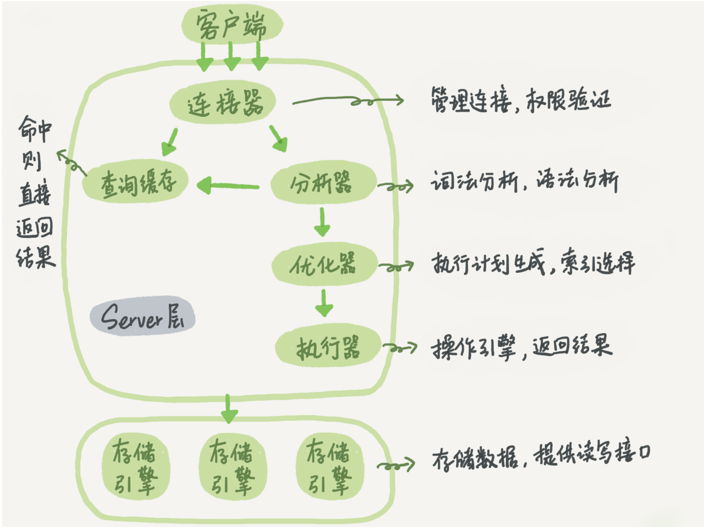
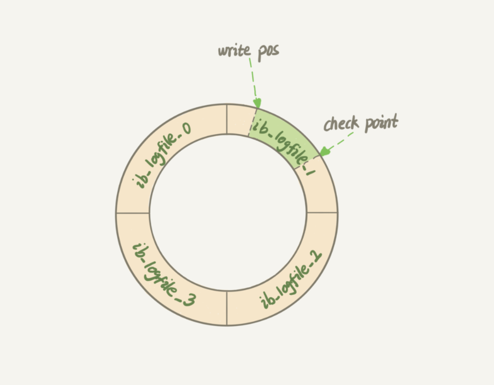
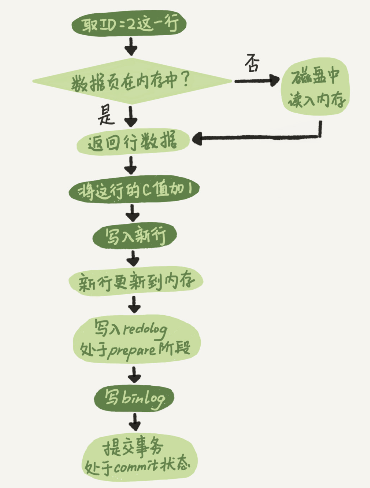
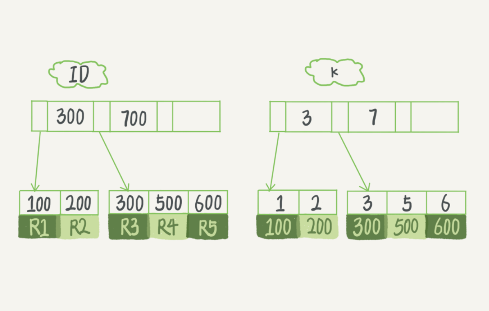
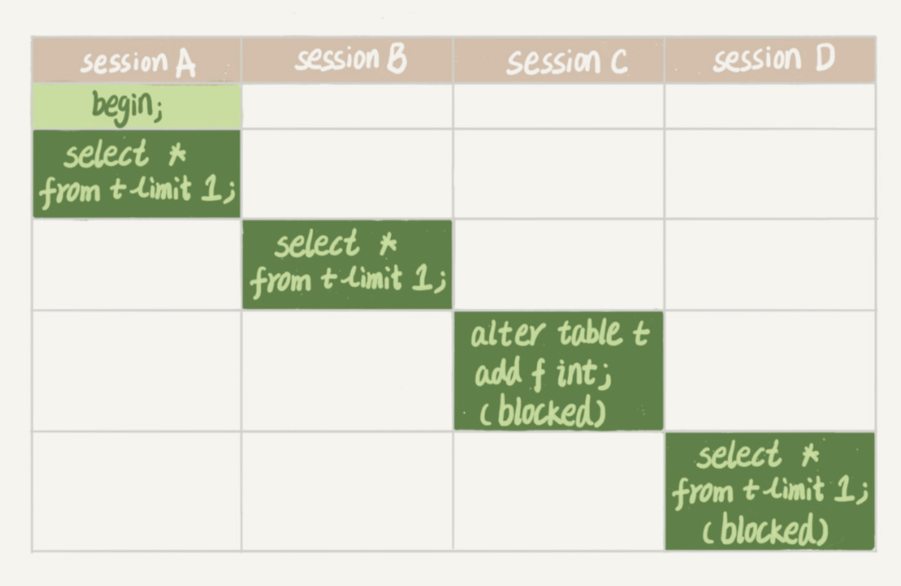
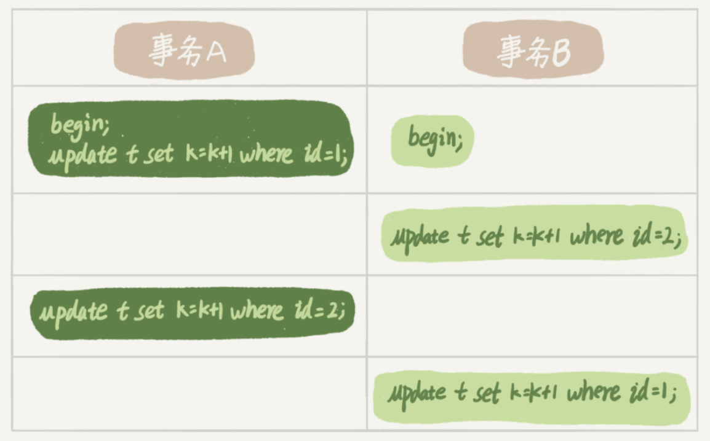

# MySQL_study_memo

## [01 | 基础架构：一条SQL查询语句是如何执行的？](https://time.geekbang.org/column/article/68319)

- 存储引擎层
  - 负责数据的存储和提取
  - 存储引擎插件式: InnoDB、MyISAM、Memory等  
  ※ MySQL v5.5.5起以InnoDB为默认存储引擎



 - 连接器
   - 参数 wait_timeout(8h,默认值)
   - 长连接
     - MySQL执行时使用的内存会在连接断开时释放，长连接过久有可能导致内存消耗大
     - 推荐定期断开长连接
     - (>= MySQL v5.7)执行 mysql_reset_connection 来重新初始化连接资源，无需重连和权限验证

- 查询缓存 (MySQL 8.0开始无此功能)
  - 只要有对一个表的 **更新**，这个表上 **所有的查询缓存都会被清空**
  - 长时间才会更新的 **静态表** 比较推荐使用缓存
  - query_cache_type → DEMAND : 默认的 SQL 语句都不使用查询缓存

- 分析器
  - **识别** MySQL语句里面的字符串分别是什么，代表什么
  - **分析** MySQL语法

- 优化器
  - 多个索引的时候，决定使用哪个索引；
  - 在一个语句有多表关联（join）的时候，决定各个表的连接顺序

- 执行器
  - 判断执行查询的权限
  - 根据表的引擎定义，使用引擎提供的接口

## [02 | 日志系统：一条SQL更新语句是如何执行的？](https://time.geekbang.org/column/article/68633)

[Write-Ahead Logging](https://ja.wikipedia.org/wiki/%E3%83%AD%E3%82%B0%E5%85%88%E8%A1%8C%E6%9B%B8%E3%81%8D%E8%BE%BC%E3%81%BF): **先写日志**，再写磁盘

- redo log
  - InnoDB特有日志
  - 当一条记录需要更新时，InnoDB引擎会先把记录写到redo log里，然后更新内存，更新完成；InnoDB会在适当的时候将这个操作记录更新写入磁盘。
  - redo log大小是固定的，使用如下图，从头开始写，写到末尾就又回到开头**循环写**  
    write pos 是当前记录的位置  
    checkpoint 是当前要擦除的位置  
    write pos 追上 checkpoint 时，这时候不能再执行新的更新，得停下来先擦掉一些记录
  - **crash-safe**: 保证即使数据库发生异常重启，之前提交的记录都不会丢失
  


- bin log 和 redo log的区别
  - bin log是server层的日志，所以引擎都可以用；redo log是InnoDB引擎特有的。
  - redo log 是物理日志，记录的是“在某个数据页上做了什么修改”；binlog 是逻辑日志，记录的是这个语句的原始逻辑，比如“给 ID=2 这一行的 c 字段加 1 ”。
  - redo log 是循环写的，空间固定会用完； binlog 是可以追加写入的。


```
mysql> create table T(ID int primary key, c int);

mysql> update T set c=c+1 where ID=2;
```
Update流程例子  
redo log 的写入拆成了两个步骤：prepare 和commit，这就是"**两阶段提交**"  
保证数据库的状态和用它的日志恢复出来的库的状态保持一致


## [03 | 事务隔离：为什么你改了我还看不见？](https://time.geekbang.org/column/article/68963)

- SQL 标准的事务(transaction)隔离级别  
**※show variables 可查看参数 transaction-isolation 的值**

  1. 读未提交（read uncommitted）
    - 一个事务还没提交(commit)时，它做的变更就能被别的事务看到
  2. 读提交（read committed
    - 一个事务提交之后，它做的变更才会被其他事务看到
  3. 可重复读（repeatable read）
    - 一个事务执行过程中看到的数据，总是跟这个事务在启动时看到的数据是一致的
    - 未提交变更对其他事务也是不可见的
  4. 串行化（serializable ）
    - 对于同一行记录，“写”会加“写锁”，“读”会加“读锁”
    - 当出现读写锁冲突的时候，后访问的事务必须等前一个事务执行完成，才能继续执行

- MySQL 的事务启动方式有以下两种
  1. begin 或 start transaction ,配套的提交语句是 commit，回滚语句是 rollback
  2. set autocommit=0，这个命令会将这个线程的自动提交关掉
    - **注意**: 有些客户端连接框架会默认连接成功后先执行一个 set autocommit=0 的命令。
    - 建议使用 set autocommit=1 和 [commit work and chain](https://dev.mysql.com/doc/refman/5.6/ja/commit.html)（提交事务后自动启动下一个事务)

- **查询长事务**
  - 示例：用information_schema 库的 **innodb_trx** 查找持续时间超过 60s 的事务
```
select * from information_schema.innodb_trx where TIME_TO_SEC(timediff(now(),trx_started))>60
```

## [04 | 深入浅出索引（上）](https://time.geekbang.org/column/article/69236)

InnoDB 使用 **B+ 树** 索引模型，数据都存储在 B+ 树中的

- 每一个索引在 InnoDB 里面对应一棵 B+ 树
  - 主键索引(**clustered index**)的叶子节点存的是 **整行数据**
  - 非主键索引(**secondary index**)的叶子节点内容是 **主键的值**


- 示例
```
mysql> create table T(
id int primary key,
k int not null,
name varchar(16),
index (k))engine=InnoDB;
```
表中 R1~R5 的 (ID,k) 值分别为 (100,1、(200,2)、(300,3)、(500,5) 和 (600,6)



- 基于主键索引和普通索引的查询的区别
  - select * from T where ID=500, 即主键查询方式，则只需要搜索 ID 这棵 B+ 树
  - select * from T where k=5，即普通索引查询方式，则需要先搜索 k 索引树得到 ID 的值为 500，再到 ID 索引树搜索一次。这个过程称为 **回表**


InnoDB 的 [B+树](https://techlife.cookpad.com/entry/2017/04/18/092524)

- 参考资料
  - [B TreeとB+ Treeの違い](https://christina04.hatenablog.com/entry/2017/05/17/190000)
  - [ヤフー社内でやってるMySQLチューニングセミナー大公開](https://www.slideshare.net/techblogyahoo/mysql-58540246)

## [05 | 深入浅出索引（下）](https://time.geekbang.org/column/article/69636)

- 覆盖索引: (查询字段已经在索引里)无需 **回表** 的索引
- 联合索引: 根据创建联合索引的顺序，以最左原则进行where检索
  - 最左前缀 → 联合索引的最左 N 个字段，也可以是字符串索引的最左 M 个字符
- 索引下推:
  - MySQL 5.6 引入的索引下推优化（index condition pushdown）
  - 可以在索引遍历过程中，对索引中包含的字段先做判断，直接过滤掉不满足条件的记录，减少回表次数

## [06 | 全局锁和表锁 ：给表加个字段怎么有这么多阻碍？](https://time.geekbang.org/column/article/69862)

MySQL里面的锁: 全局锁，表级锁，行锁

- 全局锁
  - 对真个数据库加锁，命令是 Flush tables with read lock(FTWRL)
  - 典型使用场景是，做全库逻辑备份

官方逻辑备份工具 mysqldump,当使用 **参数–single-transaction** 的时候，导数据之前就会启动一个事务，来确保拿到 **一致性视图**。由于 **MVCC** 的支持, 这个过程中**数据是可以正常更新**

- 表级锁(2种)
  - 表锁
    - 语法: lock tables … read/write
    - 释放锁的方式： unlock tables主动释放；客户端断开时自动释放
    - 不仅影响其他线程，也影响自己
  - 元数据锁(meta data lock: MDL)
    - MySQL v5.5时引入MDL
    - (系统默认自动加)当对一个表做增删改查操作的时候，加 MDL 读锁；当要对表做结构变更操作的时候，加 MDL 写锁
    - **读锁之间不互斥**，因此你可以有多个线程同时对一张表增删改查
    - **读写锁之间、写锁之间是互斥的**



- sessionA 执行 **begin**, select语句时自动加读锁
- sessionB 执行select语句时自动加读锁，读锁之间不互斥，没有影响
- sessionC 执行alter语句时加写锁，因与sessionA，sessionB的读锁互斥，需等待sessionA，sessionB解锁
- sessionD 执行select语句时自动加读锁，因与sessionC的写锁互斥，需等待sessionC解锁
- **★ 如果该表查询语句频繁，且客户端有重试机制的话，这个数据库的线程很快就会爆满**
  - ★★避免该问题的方法： **在 alter table 语句里面设定等待时间**


## [07 | 行锁功过：怎么减少行锁对性能的影响？](https://time.geekbang.org/column/article/70215)

MySQL的行锁是在引擎层由各引擎实现，InnoDB有行锁

在InnoDB事务中，行锁是在需要的时候加上，在事务结束时释放

- 死锁
  - 线程都进入无限等待的状态
  - 死锁的列子
  


- 对应死锁的策略
  - 设置超时时间参数: innodb_lock_wait_timeout(InnoDB默认值为50s)
  - 死锁检测(参数 innodb_deadlock_detect = on)，发现死锁后，主动回滚死锁链条中的某一个事务。  
  需注意CPU消耗问题

## [08 | 事务到底是隔离的还是不隔离的？](https://time.geekbang.org/column/article/0?cid=139)

- begin/start transaction 命令后，执行第一个操作 InnoDB 表的语句时事务才真正启动
- 执行start transaction with consistent snapshot 后马上启动一个事务

- MySQL 里，有两个“视图”的概念
  - 一个是 view。它是一个用查询语句定义的虚拟表，在调用的时候执行查询语句并生成结果。创建视图的语法是 create view … ，而它的查询方法与表一样
  - InnoDB 在实现 MVCC 时用到的一致性读视图，即 consistent read view， 用于支持 RC（Read Committed，读提交）和 RR（Repeatable Read，可重复读）隔离级别的实现


- 一个数据版本，对于一个事务视图来说，除了自己的更新总是可见以外，有三种情况:
  - 版本未提交，不可见
  - 版本已提交，但是是在视图创建后提交的，不可见
  - 版本已提交，而且是在视图创建前提交的，可见


- 更新数据都是先读后写的，而这个读，只能读当前的值，称为“当前读”（current read）

- 可重复读的核心就是一致性读（consistent read）; 而事务 **更新数据的时候，只能用当前读**。如果当前的记录的行锁被其他事务占用的话，就需要进入锁等待

- 在可重复读隔离级别下，只需要在事务开始的时候创建一致性视图，之后事务里的其他查询都共用这个一致性视图
- 在读提交隔离级别下，每一个语句执行前都会重新算出一个新的视图

- InnoDB 的行数据有多个版本，每个数据版本有自己的 row trx_id，每个事务或者语句有自己的一致性视图
- 普通查询语句是一致性读(consistent read view)，一致性读会根据 row trx_id和一致性视图确定数据版本的可见性
  - 对于可重复读(RR: Repeatable Read)，查询只承认在事务启动前就已经提交完成的数据
  - 对于读提交(RC: Read Committed)，查询只承认在语句启动前就已经提交完成的数据

- **MySQL默认采用RR隔离级别**
  - 更改mysql全局隔离级别为RC
  ```
  set global tx_isolation = 'READ-COMMITTED'
  ```


- 事务如何实现的MVCC
  - (1)每个事务都有一个事务ID,叫做transaction id(严格递增)
  - (2)事务在启动时,找到已提交的最大事务ID记为up_limit_id。
  - (3)事务在更新一条语句时,比如id=1改为了id=2.会把id=1和该行之前的row trx_id写到undo log里,并且在数据页上把id的值改为2,并且把修改这条语句的transaction id记在该行行头
  - (4)再定一个规矩,一个事务要查看一条数据时,必须先用该事务的up_limit_id与该行的transaction id做比对,
  如果up_limit_id>=transaction id,那么可以看.如果up_limit_id<transaction id,则只能去undo log里去取。去undo log查找数据的时候,也需要做比对,必须up_limit_id>transaction id,才返回数据


- 为什么rr能实现可重复读而rc不能,分两种情况
  - (1)快照读的情况下,rr不能更新事务内的up_limit_id,而rc每次会把up_limit_id更新为快照读之前最新已提交事务的transaction id,则rc不能可重复读
  - (2)当前读的情况下,rr是利用record lock+gap lock来实现的,而rc没有gap,所以rc不能可重复读


- RR是通过事务启动时创建一致性识图来实现，RC是语句执行时创建一致性识图来实现。


- 快照读(Snapshot Read)
  - MySQL数据库，InnoDB存储引擎，为了提高并发，使用MVCC机制，在并发事务时，通过读取数据行的历史数据版本，不加锁，来提高并发的一种不加锁一致性读(Consistent Nonlocking Read)

## 09 | 普通索引和唯一索引，应该怎么选择？

- 唯一索引
  - 查找到满足条件的记录后，停止检索

- 普通索引
  - 查找到满足条件的记录后，会查找下一个记录，知道不满足条件位置

- InnoDB读数据时，以页为单位从磁盘里读入内存，默认大小为16KB

- change buffer
  - 更新数据页时，如果数据页在内存中的话就直接更新，如果不在的话，InnoDB会把更新的操作缓存在change buffer中。再下次的数据查询中，InnoDB会把数据页读入内存，然后执行(merge)change buffer里保存的与这个数据页相关的操作
  - 触发merge的情况: 查询该数据页中的数据、后台定期merge、shutdown数据库
  - 作用: 减少读磁盘，提升SQL语句执行速度
  - 普通索引可以使用，而唯一索引不能使用change buffer
  - 将数据从磁盘读到内存设计随机IO的方位，是数据库里成本最高的操作之一。changer buffer减少了随机磁盘访问，所以更新的性能有明显的提升

- 实际示例: 某数据库内存命中率突然下降，导致整个系统处于都塞状态。究其原因，使用该数据库的 **业务有大量插入数据的操作** ，可是DBA在某天把其中的某个 **普通索引改成了唯一索引**

- change buffer使用效果好的场景
  - 写多读少的业务，更新数据后不会马上访问该数据的场景,比如账单类，日志类系统

- redo log和change buffer
  - redo log: 主要节省的是随机写磁盘的 IO 消耗（转成顺序写）
  - change buffer: 主要节省的则是随机读磁盘的 IO 消耗

## 10 | MySQL为什么有时候会选错索引？

- 优化器在语句执行前会自动选择用(最优的)索引，但偶尔也会选错索引

- 基数(cardinality): 一个索引上不同只的个数。基数越大，索引上的区分度越好。
  - InnoDB默认选择 N 个页面，统计这些页面上的不同的值，得到平均值，然后乘以页面数就得到了这个索引的基数。
  - 当数据行数超过 1/M 时，自动触发重新做一次索引的统计。
  - 可以通过设置参数 innodb_stats_persistent 的值来选择
      - 设置为 on 的时候，表示统计信息会持久化存储。这时，默认的 N 是 20，M 是10
      - 设置为 off 的时候，表示统计信息只存储在内存中。这时，默认的 N 是 8，M 是16 

- 统计的信息不正确时，可以通过 `analyze table <table_name>` 来重新统计索引信息。

## 11 | 怎么给字符串字段加索引？

- 为字符串(比如邮箱qiu*****@gmail.com)加索引时
  - 直接加索引，只要回主键的取一次数据。但占用空间大
  - 用前缀索引，必须选择合适的长度。可以用 一下方法
    - 首先 ，用 `mysql> select count(distinct email) as L from <table_name>;` 来计算出列上有多少不同的值。
    - 其次 `mysql> select 
  count(distinct left(email,4)）as L4 from SUser;`
    - 用 L 和 L4 的值来判断多少(比如95%)可以接受。

- 用前缀索引是，遇到区分度不怎么好的情况(比如身份证编号)，可考虑一下方法
  - 倒序存储
    - `mysql> select field_list from t where id_card = reverse('input_id_card_string');`
    - 
  - 使用 hash 字段
    - `mysql> alter table t add id_card_crc int unsigned, add index(id_card_crc);`

- 倒序存储 和 使用 hash 字段 的异同点
  - 相同点: 都不支持范围查询
  - 不同点:
    - 从占用的额外空间来看，倒序存储方式在主键索引上，不会消耗额外的存储空间，而 hash 字段方法需要增加一个字段
    - 在 CPU 消耗方面，倒序方式每次写和读的时候，都需要额外调用一次 reverse 函数，而 hash 字段的方式需要额外调用一次 crc32() 函数。从计算复杂度来看的话，reverse 函数额外消耗的 CPU资源会更小些
    - 从查询效率上看，使用 hash 字段方式的查询性能相对更稳定。因为 crc32 算出来的值虽然有冲突的概率，但是概率非常小。

为字符串创建索引，可以使用一下方式
- 直接创建完整索引，这样可能比较占用空间
- 创建前缀索引，节省空间，但会增加查询扫描次数，并且不能使用覆盖索引
- 倒序存储，再创建前缀索引，用于绕过字符串本身前缀的区分度不够的问题
- 创建 hash 字段索引，查询性能稳定，有额外的存储和计算消耗，跟第三种方式一样，都不支持范围扫描


.
